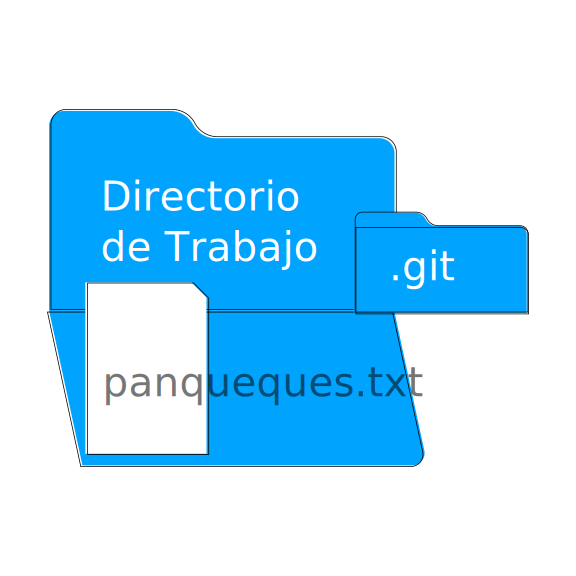

# Introducción a Control de Versiones con Git

## Preliminares

Antes de la existencia de los [VCS](https://es.wikipedia.org/wiki/Control_de_versiones), 

### Parches

Supongamos que recibimos un diskette por correo con un proyecto para corregir. El proyecto se ve más o menos así: 

```console
dev0:codigo usuario$ tree -a -L 2 original/
original/
├── dias.txt
├── meses.txt
└── otros
    └── estaciones.txt

1 directory, 3 files
dev0:codigo usuario$
```

Consiste de unas listas de días, meses y estaciones. Contamos con poco tiempo para hacerlo, contamos con un módem de algunos baudios y nos ahorraríamos el tiempo que insumiría devolver el diskette por correo. Si mandamos solamente las modificaciones, podemos ahorrar mucho tiempo de conexión telefónica. Por suerte, desde hace varias décadas existen las herramientas que permiten lograrlo.

Copiamos todo el árbol de directorios y hacemos las correcciones sobre la copia:

```console
dev0:codigo usuario$ cp -r original/ nuevo
dev0:codigo usuario$ cd nuevo/
dev0:nuevo usuario$ vim dias.txt
```

Notamos que falta el jueves, lo agregamos:

<table>
  <tr>
    <th>original</th>
    <th>nuevo</th>
  </tr>
  <tr>
    <td>
      <pre>
domingo
lunes
martes
miércoles<br />
viernes
sábado
      </pre>
    </td>
    <td>
      <pre>
domingo
lunes
martes
miércoles
<b>jueves</b>
viernes
sábado
      </pre>
    </td>
  </tr>
</table>

Realizamos las correcciones sobre los meses:

```console
dev0:nuevo usuario$ vim meses.txt
```

<table>
  <tr>
    <th>original</th>
    <th>nuevo</th>
  </tr>
  <tr>
    <td>
      <pre>
enero
fe<b>rb</b>ero
marzo
abril
mayo
julio
agosto
<b>junio</b>
septiembre
octubre
noviembre
diciembre
      </pre>
    </td>
    <td>
      <pre>
enero
fe<b>br</b>ero
marzo
abril
mayo
<b>junio</b>
julio
agosto
septiembre
octubre
noviembre
diciembre
      </pre>
    </td>
  </tr>
</table>

Adaptamos el orden de las estaciones al hemisferio sur:

```console
dev0:codigo usuario$ vim otros/estaciones.txt
```
<table>
  <tr>
    <th>original</th>
    <th>nuevo</th>
  </tr>
  <tr>
    <td>
      <pre>
<b>invierno</b>
<b>primavera</b>
verano
otoño
      </pre>
    </td>
    <td>
      <pre>
verano
otoño
<b>invierno</b>
<b>primavera</b>
      </pre>
    </td>
  </tr>
</table>


### El repositorio git

Git es una herramienta de control de versión de operación local y


## Configurando Git por primera vez

Git administra la configuración en tres niveles: por instalación, por usuario y por proyecto.
Esta configuración se almacena en archivos de texto, los cuales no es necesario modificar manualmente, ya que para este fin la herramienta provee el subcomando `git config`.

### Configuración por instalación

La configuración por instalación se almacena en `/etc/gitconfig` en sistemas UNIX o Linux, y en `C:\ProgramData\Git\config` en sistemas Windows. Para modificarla, el subcomando `git config` requiere la opción `--system`.

### Configuración por usuario

La configuración por usuario se almacena en `/home/[usuario]/.gitconfig` o bien en `/home/[usuario]/.config/git/config` en sistemas UNIX o Linux, y en `C:\Users\$USER` en sistemas Windows. Para modificarla, el subcomando `git config` requiere la opción `--global`.

### Configuración por proyecto

Ya dentro de un proyecto, la configuración es almacenada dentro del mismo repositorio. Esta se puede encontrar en  `.git/config`. Este es el caso por defecto del subcomando `git config`, para el cual existe la opción `--local` si se desea explicitarla.

Cabe destacar que si bien esta configuración es almacenada en el directorio ocupado por el repositorio, es propia de la instancia local, o sea, no se propaga a repositorios remotos.

### Ejemplo

La instalación de Git no incluye ninguna configuración inicial en ningún nivel. Podemos verificarlo para el nuevo usuario llamado convenientemente `usuario`:

```console
dev0:codigo usuario$ git config --list
dev0:codigo usuario$ 
```

Interactuar con un repositorio Git en este estado de precariedad no es imposible, ya que la herramienta puede deducir los datos requeridos para registrar los cambios a partir de la configuración del sistema operativo.
No obstante, se considera de buen gusto proveer nombre completo y dirección de correo electrónico estables, para evitar posteriormente tener que realizar modificaciones de bajo nivel al historial.

El nombre puede contener caracteres no-ASCII (por ejemplo los acentuados), pero éstos no son mostrados por defecto por Git en su historial, excepto que se setee la propiedad `core.quotepath off` en la configuración.

Debe tenerse en cuenta que si el proyecto es compartido con otros usuarios, éstos pueden no tener la misma configuración establecida (o no contar con el encoding adecuado), y verán los caracteres no-ASCII como códigos octales.
Estos problemas suelen abordarse con consenso sobre la configuración a utilizar, o bien decantando voluntariamente en un nombre condescendientemente anglocéntrico, como "Jose Maria Patinio".

Para nuestro usuario *usuario*, podemos establecer la configuración mínima de la siguiente manera:

```console
dev0:codigo usuario$ git config --global user.name "Usuario"
dev0:codigo usuario$ git config --list
user.name=Usuario
dev0:codigo usuario$ git config --global user.email "usuario@example.com"
dev0:codigo usuario$ git config --list
user.name=Usuario
user.email=usuario@example.com
dev0:codigo usuario$ 
```

Ésto se refleja en el archivo anteriormente mencionado:

```console
dev0:codigo usuario$ more ~/.gitconfig
[user]
  name = Usuario
  email = usuario@example.com
dev0:codigo usuario$ 
```

Git aplica la configuración a nivel sistema primero, luego la de usuario y finalmente la del proyecto, permitiendo de esta manera que el usuario tenga oportunidad de redefinir ciertas propiedades en proyectos específicos, como por ejemplo, un correo electrónico laboral en proyectos laborales y otro personal para el resto.

## El repositorio local


Git no es la única herramienta de control de versión, pero sí es la única que en la actualidad es considerada estándar de facto. Cualquier faena que un profesional del software emprenda hoy en día, casi con seguridad incluye interactuar con repositorios Git. Al tratarse de una herramienta tan básica y omnipresente, entenderla desde lo fundamental es una inversión de alto retorno.

El modo de uso fundamental de Git es local. Un repositorio Git lleva a cuestas toda la historia del proyecto. Esta característica es explícita en su diseño, ya que garantiza la performance necesaria para gestionar proyectos muy grandes.

La interacción del usuario siempre es con el repositorio local, mientras que la interacción con repositorios remotos se da siempre con el repositorio local mediante.
Esto es, un usuario no impacta cambios en un repositorio remoto de manera directa, sino que primero tiene que lograr un repositorio local en estado coherente, para luego hacerlo congeniar con repositorios remotos.
La rutina típica de bajarse una copia de un proyecto de un repositorio centralizado y contribuir cambios lleva implícito un workflow distribuído, por más que no lo parezca a primera vista.
Ciertas herramientas suelen contribuir a esta confusión: muchos agentes Git integrados en IDEs unifican interacciones locales con remotas, dando la apariencia de estar interactuando directamente con el repositorio remoto. Muy posiblemente se deba a que previamente ese nicho funcional era ocupado por herramientas verdaderamente cliente/servidor, como CVS o SVN, y se haya buscado una transición lo más ergonómica posible.

Por este y otros motivos, recomendamos fuertemente fijar los conceptos propios de Git con la herramienta oficial, que funciona en terminales de línea de comandos como Bash o PowerShell.
Si resulta poco familiar o intimidante este tipo de entorno, es una buena oportunidad para interiorizarse un poco. Vamos a limitarnos a `git` y a comandos muy básicos, como por ejemplo:

  - `more`: muestra el contenido de un archivo
  - `ls`: lista el contenido de un directorio, si no se especifica, es del actual
  - `tree`: lo mismo que `ls`, pero mostrando el árbol en forma jerárquica 
  - `cd`: cambia el directorio actual
  - `mkdir`: crea un nuevo directorio

Adicionalmente, vamos a utilizar un editor de texto. En este caso usamos `vim`, pero como creemos que el masoquismo debe ser voluntario, donde usamos `vim`, se puede perfectamente usar el editor que quieran, como por ejemplo `nano`, que es un poco más amable.

Supongamos que nos gusta cocinar y mantener nuestras recetas debidamente documentadas. Para ello, hacemos uso de un ordenador personal y procedemos a crear un directorio para nuestro proyecto de recetario. Usamos esta temática en lugar de código fuente para no andar mezclando terminologías similares y que quede bien clara la divisoria entre lo que es fuente y lo que es control de versión:

```console
dev0:codigo usuario$ mkdir recetario
dev0:codigo usuario$ cd recetario/
dev0:recetario usuario$ tree -a -L 1
.
0 directories, 0 files
dev0:recetario usuario$ 
```

Si contamos con la herramienta `git` [debidamente instalada](https://git-scm.com/downloads), podemos verificar que nuestro proyecto recetario no cuenta con un repositorio:

```console
dev0:recetario usuario$ git status
fatal: Not a git repository (or any of the parent directories): .git
dev0:recetario usuario$ 
```

Esto se remedia facilmente, inicializando un repositorio:

```console
dev0:recetario usuario$ git init
Initialized empty Git repository in /home/usuario/codigo/recetario/.git/
dev0:recetario usuario$ 
```

Con el comando `git init`, `git` inicializa el estado del repositorio local, almacenado en un directorio llamado `.git` dentro del directorio del proyecto (por convención UNIX, los archivos y directorios cuyos nombres comienzan con `.`, son considerados ocultos).
Profundizando un poco en la estructura de ese árbol de directorios, podemos apreciar que `git` guarda sus cosas ahí adentro:


```console
dev0:recetario usuario$ tree -a -L 2
.
└── .git
    ├── branches
    ├── config
    ├── description
    ├── HEAD
    ├── hooks
    ├── info
    ├── objects
    └── refs

6 directories, 3 files
dev0:recetario usuario$ 
```

Repetimos nuevamente el subcomando `git status`, y `git` nos confirma que el repositorio ya existe:

```console
dev0:recetario usuario$ git status
On branch master

Initial commit

nothing to commit (create/copy files and use "git add" to track)
dev0:recetario usuario$ 
```

Comencemos por agregar una receta. Usando el procesador de texto que más nos guste, o el que consigamos:

```console
dev0:recetario usuario$ vim panqueques.txt
```

Podemos redactar una receta más o menos así. No es tan importante. La gracia del control de versión es que todo está para ser modificado luego:

```
Panqueques (entre 9 y 12 unidades)

Ingredientes:
huevo, 1 unidad
leche, 1 taza
harina, 1 taza
azúcar o sal, a gusto
manteca derretida, una cucharada

Preparación:
batir el huevo y la leche
incorporar la harina
incorporar el azúcar o la sal
incorporar la manteca derretida
cocinar de ambos lados en sartén antiadherente
```
<p align="right"> 
  
</p>

El directorio actual, sin considerar el subdirectorio `.git`, almacena lo que Git denomina *Working Copy*, o copia de trabajo.
Esta copia es sobre la cual trabajamos, y a partir de la cual Git computa las modificaciones que debe ir acumulando el historial.

Si volvemos a ejecutar el subcomando `status`, la herramienta reconoce que hay un nuevo archivo del cual no guarda seguimiento:

```console
dev0:recetario usuario$ git status
On branch master

Initial commit

Untracked files:
  (use "git add <file>..." to include in what will be committed)

        panqueques.txt

nothing added to commit but untracked files present (use "git add" to track)
dev0:recetario usuario$ 
```

También podemos consultar el historial, el cual se encuentra vacío:

```console
dev0:recetario usuario$ git log
fatal: your current branch 'master' does not have any commits yet
dev0:recetario usuario$ 
```

Lo que nos está diciendo con eso es que la rama en la que estamos (se tomó el atrevimiento de ponerle *master*, pero eso se puede cambiar), no tiene ningún **commit**. Por **commit** se entiende un paquete de cambios que se realizan todos juntos, de manera atómica, sobre archivos y/o directorios preexistentes en la historia. Es similar al patch o delta que vimos preliminarmente, solo que además referencia a un commit anterior.
De esas cadenas de commits se deduce ese concepto de **branch** o **rama**, central en casi todo VCS como mecanismo para *aislar cambios*.
Cada commit es un fotograma en la historia de la fuente, y Git nos permite posicionarnos en cualquier punto de esta historia, mientras cuente con un commit.
Mediante el subcomando `git add` ponemos a Git al corriente de que existe el archivo `panqueques.txt` agregándolo al índice del repositorio:

```console
dev0:recetario usuario$ git add panqueques.txt
dev0:recetario usuario$ git status
On branch master

Initial commit

Changes to be committed:
  (use "git rm --cached <file>..." to unstage)

        new file:   panqueques.txt

dev0:recetario usuario$ 
```

  El índice (**index**) es una estructura de datos que determina en qué difiere la copia de trabajo con el fotograma utilizado como base. Agregar los cambios al índice de seguimiento se lo suele denominar **to stage** (algo así como "preparar", o "poner en escena"), ya que son los cambios que Git compone preliminarmente como nuevo paquete para crear un nuevo commit.
Como se puede apreciar ejecutando el subcomando `git log`, agregar un cambio al *stage* del repositorio, no altera la historia:

```console
dev0:recetario usuario$ git log
fatal: your current branch 'master' does not have any commits yet
dev0:recetario usuario$ 
```

Una vez que tenemos bien determinado el conjunto de cambios que va a componer el próximo commit, confirmamos la operación con el subcomando `git commit`:

```console
dev0:recetario usuario$ git commit -m "Nueva receta de panqueques"
[master (root-commit) 0f2d91b] Nueva receta de panqueques
 1 file changed, 9 insertions(+)
 create mode 100644 panqueques.txt
dev0:recetario usuario$ 
```

Este subcomando requiere un comentario entendible por seres humanos para poder facilitar la comprensión de la sucesión de cambios en el log del branch actual.
Luego de confirmar los últimos cambios, podemos ver que el índice no registra diferencias con respecto al último commit:

```console
dev0:recetario usuario$ git status
On branch master
nothing to commit, working tree clean
dev0:recetario usuario$ 
```

Estos cambios quedaron registrados en el historial:

```console
dev0:recetario usuario$ git log
commit 0f2d91b99ba534624e6c7d007bf415bc3b2544e5
Author: Usuario <usuario@example.com>
Date:   Mon Sep 28 16:29:42 2020 -0300

    Nueva receta de panqueques
dev0:recetario usuario$ 
dev0:recetario usuario$ 
```

Esos números con letras que aparecen en la primera línea es un número expresado en base hexadecimal (con 16 dígitos posibles), y es un código de dispersión ("hash code") derivado del contenido de los cambios y del código del commit anterior. Son números tan grandes, que es virtualmente imposible encontrar dos commits diferentes con el mismo código de dispersión. No hace falta entrar tanto en detalle sobre estos códigos, ya que solamente necesitamos saber que son técnicamente únicos y permiten que dos colaboradores creen commits independientemente sin riesgo de que al intercambiarlos se dé una colisión.
Vamos a ilustrar una secuencia de cambios,

```console
dev0:recetario usuario$ vim panqueques.txt
```

agregando una línea nueva en el archivo:

```
Panqueques (entre 9 y 12 unidades)

Ingredientes:
huevo, 1 unidad
leche, 1 taza
harina, 1 taza
azúcar o sal, a gusto
manteca derretida, una cucharada

Preparación:
batir el huevo y la leche
incorporar la harina
incorporar el azúcar o la sal
incorporar la manteca derretida
cocinar de ambos lados en sartén antiadherente
dejar enfriar en una grilla hasta que elimine el vapor
```

Vemos nuevamente que Git detecta que cambiamos el contenido del directorio de trabajo:

```console
dev0:recetario usuario$ git status
On branch master
Changes not staged for commit:
  (use "git add <file>..." to update what will be committed)
  (use "git checkout -- <file>..." to discard changes in working directory)

        modified:   panqueques.txt

no changes added to commit (use "git add" and/or "git commit -a")
dev0:recetario usuario$ 
```

Agregamos el archivo, y ahora reconoce los cambios para ser commiteados:

```console
dev0:recetario usuario$ git add panqueques.txt
dev0:recetario usuario$ git status
On branch master
Changes to be committed:
  (use "git reset HEAD <file>..." to unstage)

        modified:   panqueques.txt

```

Lo cual hacemos a continuación:

```console
dev0:recetario usuario$ git commit -m "Actualizo receta de panqueques"
[master 398e592] Actualizo receta de panqueques
 1 file changed, 1 insertion(+)
dev0:recetario usuario$ 
```

Pedir nuevamente el `log` (bitácora de la rama actual) nos muestra la cadena de commits, comenzando desde el más reciente:

```console
dev0:recetario usuario$ git log
commit 398e59280c1bd44a6a50a6571bfa1c00974580f3
Author: Usuario <usuario@example.com>
Date:   Mon Sep 28 16:54:56 2020 -0300

  Actualizo receta de panqueques

commit 0f2d91b99ba534624e6c7d007bf415bc3b2544e5
Author: Usuario <usuario@example.com>
Date:   Mon Sep 28 16:29:42 2020 -0300

  Nueva receta de panqueques
dev0:recetario usuario$ 
```

Con esta nutrida historia de cambios ya podemos demostrar las posibilidades que habilita contar con control de versión.
El subcomando `git checkout` cambia el directorio de trabajo para que refleje los contenidos al momento del commit pasado como parámetro.

```console
dev0:recetario usuario$ git checkout 0f2d91b99ba534624e6c7d007bf415bc3b2544e5
Note: checking out '0f2d91b99ba534624e6c7d007bf415bc3b2544e5'.

You are in 'detached HEAD' state. You can look around, make experimental
changes and commit them, and you can discard any commits you make in this
state without impacting any branches by performing another checkout.

If you want to create a new branch to retain commits you create, you may
do so (now or later) by using -b with the checkout command again. Example:

  git checkout -b <new-branch-name>

  HEAD is now at f79c6f7... 1
dev0:recetario usuario$ 
```

No es necesario pasar los 40 caracteres de código hash al comando. Git interpreta prefijos no ambiguos, de al menos cuatro caracteres.
El comando anterior podría haberse escrito: `git checkout 0f2d`.

El nuevo contenido del directorio de trabajo refleja el del momento de aplicación de ese commit, pero Git advierte estar en estado de *detached HEAD*.

`HEAD` es una referencia que indica el punto de partida del directorio de trabajo. Normalmente refiere simbólicamente a `refs/heads/master`, o sea, *el último commit del branch master*. 

Al ejecutar `git checkout 0f2d`, Git computa el contenido del código fuente, lo reemplaza y reapunta la referencia `HEAD` a ese commit. Esta advertencia es relevante porque el punto de partida referenciado por `HEAD` deja de ser móvil, y los commits adicionales que se agreguen no pueden ser trackeados.

Posicionar el `HEAD` en un commit específico es útil para crear una rama a partir de ese punto.


```console
dev0:recetario usuario$ 
dev0:recetario usuario$ 
dev0:recetario usuario$ 
```

```console
dev0:recetario usuario$ 
dev0:recetario usuario$ 
```

